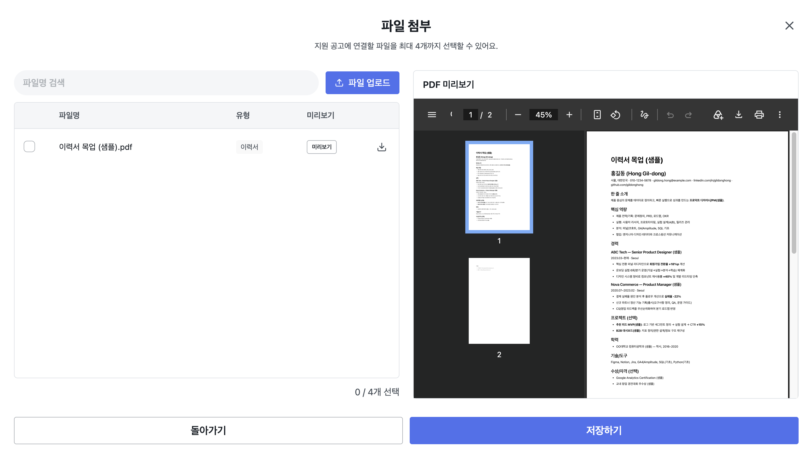

# Moah

취업 준비생이 지원 현황을 한곳에서 관리할 수 있는 서비스입니다.   https://moah.io.kr




## 프로젝트 배경

공식 채용 페이지로 지원한 내역을 관리하기 위해 노션에 회사명, 포지션, 전형 일정 등을 직접 정리했습니다. 지원이 늘어날수록 정보를 입력하고 제출한 이력서와 포트폴리오를 따로 관리하는 일이 번거로워졌습니다.

이 과정을 줄이기 위해 채용 공고 URL에서 필요한 정보를 추출하고, 지원 현황과 제출 파일을 한곳에서 관리할 수 있는 서비스를 만들었습니다.

## 주요 기능

- 채용 공고 URL에서 회사명, 포지션, 경력, 마감일 등 추출
- 지원 공고 등록 및 지원 단계·전형 일정 관리
- 이력서·포트폴리오 업로드 및 미리보기
- 지원 공고와 제출 파일 연결 및 연결 내역 확인

## 기술 스택

| 구분 | 기술 |
| --- | --- |
| 프론트엔드 | React, TypeScript, Vite, Tailwind CSS |
| 상태/폼 관리 | TanStack Query, React Hook Form, Zod |
| 백엔드 | NestJS, TypeScript, Prisma |
| 데이터베이스 | PostgreSQL |
| 인증 | Google OAuth 2.0 |
| AI | Google Gemini API |
| 모노레포 | pnpm Workspace, Turborepo |
| 코드 품질 | Biome |

## 인프라


## 프로젝트 구조

```text
apps/
  moah/          # React 웹
  admin/         # 추후 개발 예정
  api/           # NestJS 서버
packages/
  contracts/     # 스키마
  shared/        # 공용 타입, 상수, 유틸리티
  ui/            # 공용 UI 컴포넌트
  tailwind-config/ # 디자인 토큰
```

## 기술적 구현

#### FE
- pnpm Workspace와 Turborepo 기반 모노레포 구성
- 공통 디자인 토큰과 UI 컴포넌트를 활용한 디자인 시스템 구축
- TanStack Query를 활용한 낙관적 업데이트 및 캐시 갱신

#### BE
- Gemini Flash API를 연동해 채용 공고 URL의 원문을 구조화된 데이터로 추출하는 API 개발
- RESTful API 설계 및 구현 (채용 공고/지원 현황 CRUD 기능 개발)
- Google OAuth 2.0 및 HttpOnly Cookie 기반 로그인 세션 구현

#### Mixpanel

API 서버에서 성공한 핵심 활동만 전송합니다. 로컬에서는 `apps/api/.env`에 아래 값을 추가하고, 운영에서는 배포 환경의 Secret/환경변수에 등록합니다.

```env
MIXPANEL_ENABLED=true
MIXPANEL_TOKEN=프로젝트_토큰
```

`distinct_id`는 로그인한 내부 `userId`이며, 이메일이나 이력서·지원 내용은 Mixpanel로 전송하지 않습니다.
