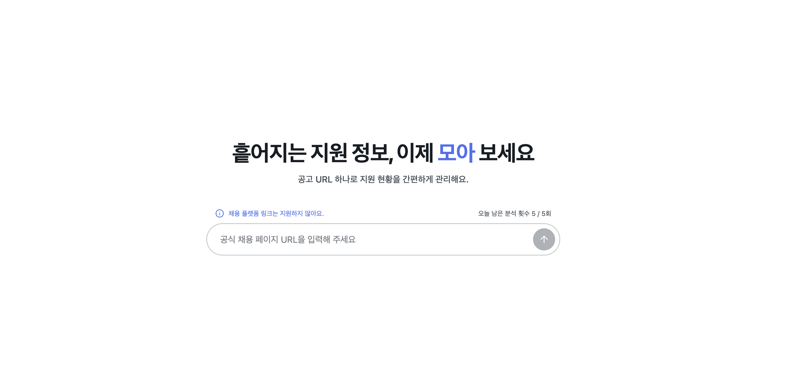
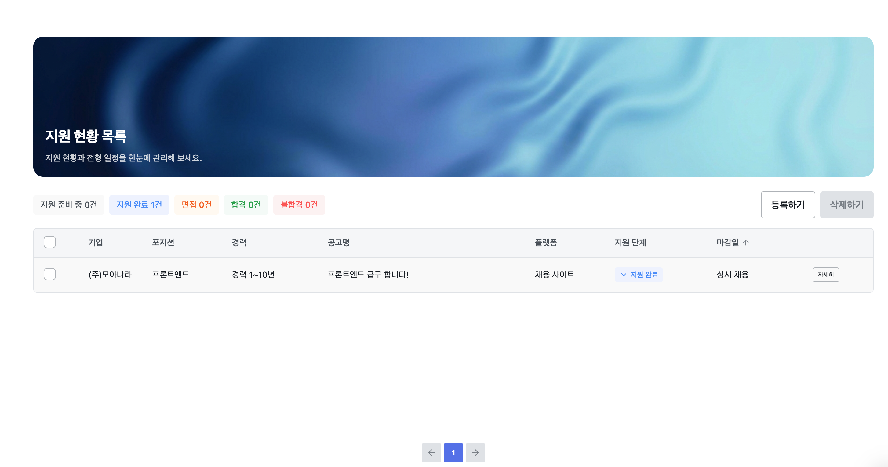
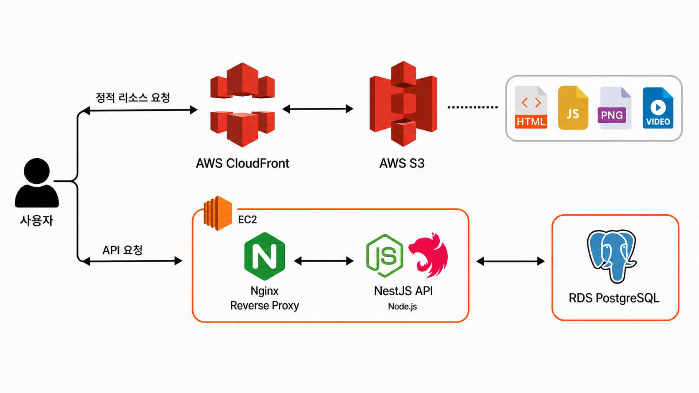

# Moah

취업 준비생이 지원 현황을 한곳에서 관리할 수 있는 서비스입니다.   https://moah.io.kr




## 주요 기능

- Gemini Flash 기반 채용 공고 URL 정보 추출
- 추출한 채용 공고와 개인 지원 목록 동시 저장
- 지원 공고 등록, 조회, 수정, 삭제 및 지원 단계 관리

## 기술 스택

| 구분 | 기술 |
| --- | --- |
| 프론트엔드 | React, TypeScript, Vite, Tailwind CSS |
| 상태/폼 관리 | TanStack Query, React Hook Form, Zod |
| 백엔드 | NestJS, TypeScript, Prisma |
| 데이터베이스 | PostgreSQL |
| 인증 | Google OAuth 2.0 |
| AI | Google Gemini API |
| 모노레포 | pnpm Workspace, Turborepo |
| 코드 품질 | Biome |

## 인프라



## 프로젝트 구조

```text
apps/
  moah/          # React 웹
  admin/         # 추후 개발 예정
  api/           # NestJS 서버
packages/
  contracts/     # 스키마
  shared/        # 공용 타입, 상수, 유틸리티
  ui/            # 공용 UI 컴포넌트
  tailwind-config/ # 디자인 토큰
```

## 기술적 구현

#### FE
- pnpm Workspace와 Turborepo 기반 모노레포 구성
- 공통 디자인 토큰과 UI 컴포넌트를 활용한 디자인 시스템 구축
- TanStack Query를 활용한 낙관적 업데이트 및 캐시 갱신

#### BE
- Gemini Flash API를 연동해 채용 공고 URL의 원문을 구조화된 데이터로 추출하는 API 개발
- RESTful API 설계 및 구현 (채용 공고/지원 현황 CRUD 기능 개발)
- Google OAuth 2.0 및 HttpOnly Cookie 기반 로그인 세션 구현
